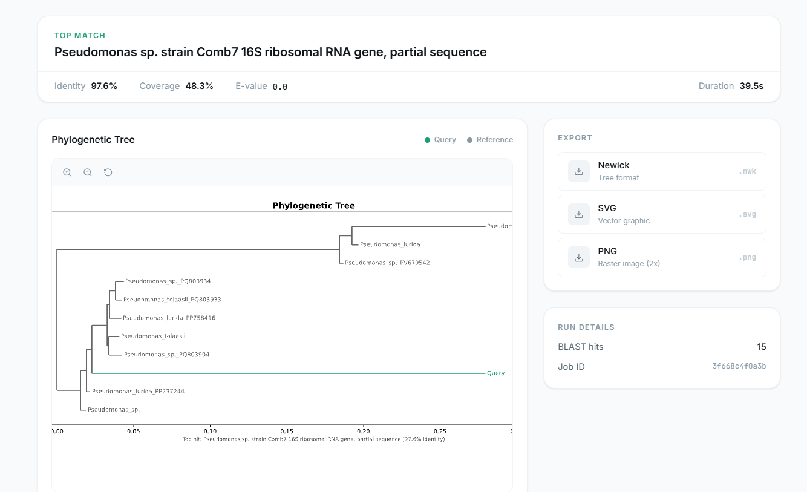
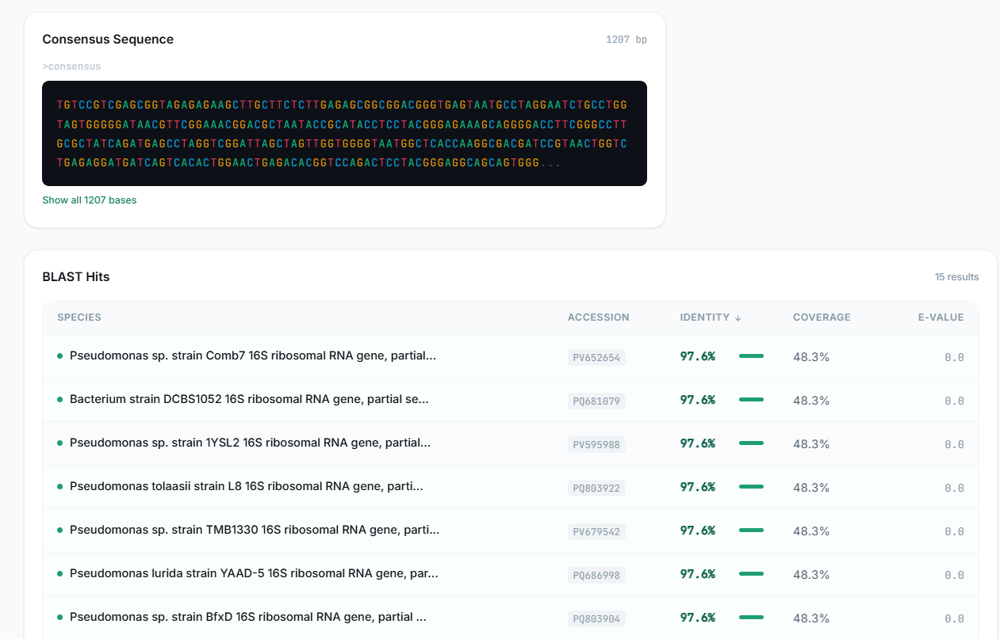

<div align="center">

# Phylomatic

**Automated phylogenetic inference from Sanger sequencing data.**

Drop in raw `.ab1` chromatograms. Get back a publication-ready phylogenetic tree.

[](https://github.com/iliasmahboub/Phylomatic/actions)
[](https://www.python.org/)
[](https://react.dev/)
[](LICENSE)

</div>

---

## Why Phylomatic?

If you've done 16S identification from Sanger reads, you know what the process looks like: open your `.ab1` files in FinchTV, trim the low-quality ends by hand, copy the sequence into BLAST, wait, grab the accession numbers, fetch references from Entrez one by one, paste everything into Clustal Omega, wait again, download the alignment, load it into MEGA, build a tree, export it, annotate it.

For one sample that's just tedious. For twenty samples it eats an entire afternoon. For a class where every student needs to do it, it's a guaranteed stream of "my BLAST timed out" and "MEGA won't open the file" emails.

Phylomatic runs the whole thing in a single click.

<div align="center">

<br/><br/>

</div>

---

## The pipeline

```
.ab1 reads ──> Consensus ──> BLASTn ──> References ──> MSA ──> NJ Tree ──> SVG
  (2 files)      FASTA        NCBI       Entrez       Clustal   BioPython   Annotated
```

1. **Assembly** -- reads forward and reverse `.ab1` chromatograms, quality-trims both ends at PHRED < 20, reverse-complements the reverse read, and builds a consensus by picking the higher-quality base at each position.

2. **BLAST** -- submits the consensus to NCBI BLASTn. Supports multiple databases: 16S ribosomal RNA (filtered for proper species-level hits), the full nucleotide collection, RefSeq RNA, or ITS for fungal work. Returns the top 15 hits with identity, coverage, and E-values.

3. **Reference fetch** -- pulls FASTA sequences for the top hits via NCBI Entrez E-utilities. Uncultured and environmental sequences are filtered out automatically so the tree shows real species names.

4. **Alignment** -- submits the consensus plus references to the EBI Clustal Omega REST API for multiple sequence alignment.

5. **Tree construction** -- builds a Neighbor-Joining tree from the alignment distance matrix using BioPython. Labels use genus + species names extracted from BLAST hit descriptions.

6. **Visualization** -- renders the tree as an annotated SVG with the query sequence highlighted. Zoomable and pannable in the browser. Exportable as SVG, PNG (2x), or Newick.

---

## Quick start

```bash
git clone https://github.com/iliasmahboub/Phylomatic.git
cd Phylomatic

pip install -r backend/requirements.txt
cd frontend && npm install && cd ..

npm run dev
```

Open **http://localhost:5173**, drop your `.ab1` files, and click **Run pipeline**. The app asks for your email at runtime (NCBI requires one for API access, no signup needed). The whole process takes 2-5 minutes depending on NCBI and EBI response times.

---

## Architecture

```
┌─────────────────────────────────────────────────────────┐
│  Frontend (React 18 + TypeScript + Vite + Tailwind)     │
│  :5173                                                  │
│  ┌──────────┐ ┌──────────────┐ ┌───────────────┐       │
│  │ DropZone │ │ PipelineTrack│ │ PhyloTree     │       │
│  │          │ │              │ │ (zoom/pan SVG)│       │
│  └──────────┘ └──────────────┘ └───────────────┘       │
│  ┌──────────────┐ ┌───────────┐ ┌──────────────┐       │
│  │ BlastResults  │ │ SeqViewer │ │ ExportPanel  │       │
│  └──────────────┘ └───────────┘ └──────────────┘       │
└────────────────────────┬────────────────────────────────┘
                         │ REST + WebSocket
┌────────────────────────┴────────────────────────────────┐
│  Backend (FastAPI + BioPython + asyncio)                 │
│  :8000                                                  │
│  ┌──────────┐ ┌──────────┐ ┌──────────┐ ┌──────────┐   │
│  │ assembly │→│  blast   │→│  entrez  │→│alignment │   │
│  └──────────┘ └──────────┘ └──────────┘ └──────────┘   │
│  ┌──────────┐ ┌──────────┐                              │
│  │   tree   │→│visualize │                              │
│  └──────────┘ └──────────┘                              │
└─────────────────────────────────────────────────────────┘
                         │
          ┌──────────────┼──────────────┐
          ▼              ▼              ▼
   NCBI BLASTn    NCBI Entrez    EBI Clustal Omega
   (URL API)      (E-utilities)  (REST API)
```

Each pipeline stage is an independent module in `backend/app/pipeline/`. They can be imported and tested without the web layer. The frontend connects over WebSocket for real-time progress.

---

## Running modules standalone

Each step works on its own from the command line:

```bash
cd backend

python -m app.pipeline.assembly fwd.ab1 rev.ab1
python -m app.pipeline.blast consensus.fasta
python -m app.pipeline.entrez ACC1 ACC2 ACC3
python -m app.pipeline.alignment refs.fasta
python -m app.pipeline.tree aligned.fasta
python -m app.pipeline.visualize tree.nwk
```

---

## Stack

| Layer | Technology |
|---|---|
| Backend | Python 3.11, FastAPI, BioPython, httpx, asyncio |
| Frontend | React 18, TypeScript, Vite, Tailwind CSS |
| External APIs | NCBI BLAST URL API, NCBI Entrez E-utilities, EBI Clustal Omega REST |
| Testing | pytest, pytest-asyncio, pytest-httpx |

---

## API

| Method | Path | Description |
|--------|------|-------------|
| `POST` | `/api/run` | Upload `.ab1` files, start pipeline |
| `GET` | `/api/status/{job_id}` | Current stage and progress |
| `GET` | `/api/results/{job_id}` | Full results (hits, SVG, Newick) |
| `WS` | `/ws/{job_id}` | Real-time stage updates |
| `DELETE` | `/api/job/{job_id}` | Clean up job data |

---

## Testing

```bash
cd backend
pytest tests/ -v
```

Unit tests cover assembly, BLAST XML parsing, and tree construction. All external API calls are mocked.

---

## Docker

```bash
docker compose up
```

---

## How it works (for non-bioinformaticians)

When scientists find an unknown bacterium, they need to figure out what species it is. One common approach is to sequence a specific gene (the 16S ribosomal RNA gene) that all bacteria have but that varies enough between species to tell them apart. Sanger sequencing reads the gene from both directions, producing two `.ab1` chromatogram files that record the raw signal from the sequencer.

Phylomatic takes those two files and:
- Cleans up the noisy ends of each read and merges them into one clean sequence
- Searches the NCBI database for the most similar known sequences
- Downloads those reference sequences
- Lines them all up (alignment) to see exactly where they differ
- Builds a family tree showing how closely related the unknown bacterium is to each known species
- Draws that tree in the browser so it can be examined, zoomed, and exported

The result is a phylogenetic tree: a branching diagram where closely related species sit near each other and the branch lengths reflect how much their DNA differs.

---

## Citation

If you use Phylomatic in your research, please cite:

```
Mahboub, I. (2026). Phylomatic: Automated phylogenetic inference from Sanger
sequencing data. https://github.com/iliasmahboub/Phylomatic
```

---

## License

MIT

---

<div align="center">

**Ilias Mahboub**

Molecular Biosciences, Duke University / Duke Kunshan University

Research Trainee @ Dzirasa Lab (Duke SM) · Yuan Lab (SJTU-SM) · Remy Lab

im132@duke.edu

</div>
