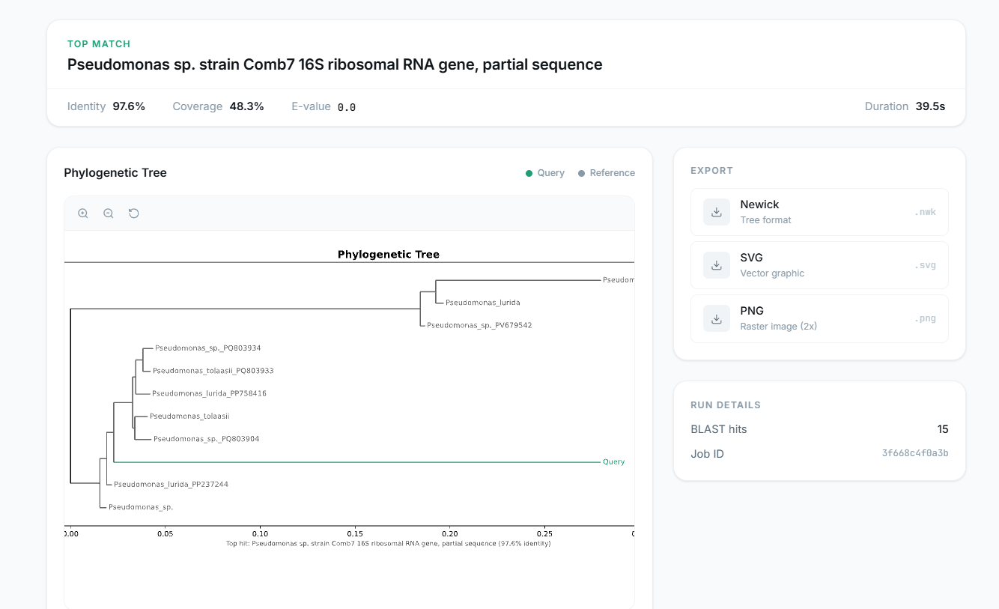
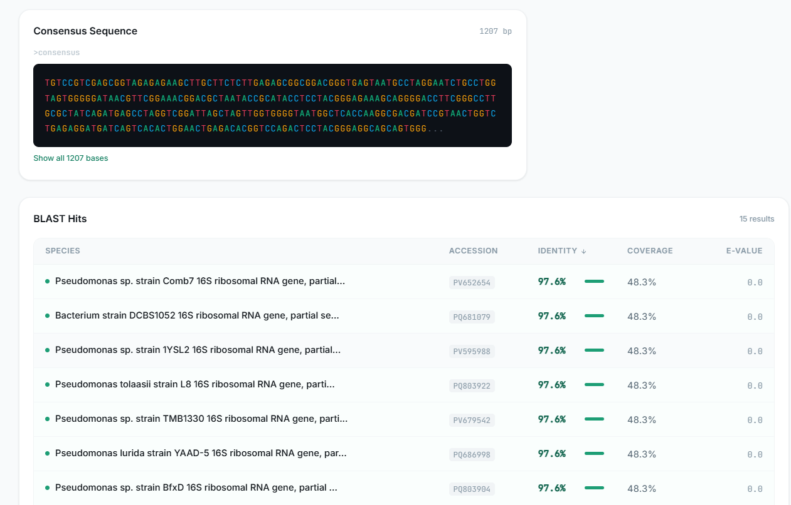

# Phylomatic

**Automated phylogenetic inference from Sanger sequencing chromatograms.**

Drop in raw `.ab1` chromatograms. Get back an annotated, exportable
phylogenetic tree.

[](https://github.com/iliasmahboub/Phylomatic/actions)
[](https://www.python.org/)
[](https://react.dev/)
[](LICENSE)

## Why Phylomatic?

Sanger-based species identification often means moving a sequence through a
chain of manual tools: chromatogram inspection, quality trimming, BLAST,
reference retrieval, multiple sequence alignment, tree construction, and figure
export. That is manageable for one isolate, but it becomes brittle in teaching
labs and small research settings where many users repeat the same workflow.

Phylomatic turns that workflow into a single browser interaction.

<div align="center">

<br/><br/>

</div>

## Pipeline

```text
.ab1 reads --> Consensus --> BLASTn --> References --> MSA --> Tree --> SVG/PNG/Newick
  2 files       FASTA        NCBI       Entrez       Clustal   BioPython
```

1. **Assembly**: reads forward and reverse `.ab1` chromatograms, trims low
   quality ends, reverse-complements the reverse read, and builds a consensus.
2. **BLAST**: submits the consensus to NCBI BLASTn and returns top hits with
   identity, coverage, and E-values.
3. **Reference fetch**: retrieves FASTA references through NCBI Entrez.
4. **Alignment**: sends the query and references to the EBI Clustal Omega REST
   API.
5. **Tree construction**: builds a Neighbor-Joining tree by default, with an
   optional FastTree maximum-likelihood path when FastTree is installed.
6. **Visualization**: renders an annotated SVG with the query highlighted and
   supports export to SVG, PNG, or Newick.

## Quick Start

```bash
git clone https://github.com/iliasmahboub/Phylomatic.git
cd Phylomatic

python -m venv .venv
.venv\Scripts\activate
python -m pip install -r backend/requirements.txt

cd frontend
npm ci
cd ..

npm run dev
```

On macOS or Linux, activate the environment with
`source .venv/bin/activate`.

Open **http://localhost:5173**, drop your `.ab1` files, and click
**Run pipeline**. The app asks for your email at runtime because NCBI requires
one for API access. No NCBI account is required.

## Docker

```bash
copy .env.example .env
docker compose up
```

On macOS or Linux, use `cp .env.example .env`.

## Architecture

```text
Frontend (:5173)
  DropZone | PipelineTracker | PhyloTree | BlastResults | SequenceViewer | ExportPanel
       |
       | REST + WebSocket
       v
Backend (:8000)
  assembly -> blast -> entrez -> alignment -> tree -> visualize
       |
       v
External services: NCBI BLASTn, NCBI Entrez, EBI Clustal Omega, optional ESMFold
```

Each pipeline stage is an independent module in `backend/app/pipeline/`. The
FastAPI layer streams progress over WebSocket while the React frontend provides
upload, status, inspection, and export views.

## Running Modules Standalone

After installing the backend dependencies from the repository root:

```bash
python -m app.pipeline.assembly fwd.ab1 rev.ab1
python -m app.pipeline.blast consensus.fasta
python -m app.pipeline.entrez ACC1 ACC2 ACC3
python -m app.pipeline.alignment refs.fasta
python -m app.pipeline.tree aligned.fasta
python -m app.pipeline.visualize tree.nwk
```

## Stack

| Layer | Technology |
|---|---|
| Backend | Python 3.11, FastAPI, BioPython, httpx, asyncio |
| Frontend | React 18, TypeScript, Vite, Tailwind CSS |
| External APIs | NCBI BLAST URL API, NCBI Entrez E-utilities, EBI Clustal Omega REST |
| Testing | pytest, pytest-asyncio, pytest-httpx |

## API

| Method | Path | Description |
|---|---|---|
| `POST` | `/api/run` | Upload `.ab1` files and start a pipeline job |
| `GET` | `/api/status/{job_id}` | Return current stage and progress |
| `GET` | `/api/results/{job_id}` | Return hits, consensus FASTA, SVG, and Newick |
| `WS` | `/ws/{job_id}` | Stream real-time stage updates |
| `POST` | `/api/structure/{job_id}` | Predict optional protein structure from consensus ORF |
| `GET` | `/api/capabilities` | Return server capabilities such as FastTree availability |
| `DELETE` | `/api/job/{job_id}` | Remove a job from memory |

## Testing

```bash
ruff check backend tools
black --check backend tools
python tools/run_backend_tests.py
npm --prefix frontend run build
```

The backend test runner disables unrelated global pytest plugin autoload and
explicitly enables `pytest-asyncio`, which keeps reviewer runs deterministic.
Unit tests cover assembly, BLAST XML parsing, Entrez fetching, alignment
polling, QC, confidence scoring, tree construction, and SVG rendering. External
API calls are mocked.

For an offline reviewer demo, see [`docs/demo.md`](docs/demo.md). For a
publication-readiness map, see
[`docs/reviewer-checklist.md`](docs/reviewer-checklist.md).

## Citation

If you use Phylomatic in research or teaching, cite the repository metadata in
[`CITATION.cff`](CITATION.cff). Until a reviewed archive DOI is available, cite:

```text
Mahboub, I. (2026). Phylomatic: automated phylogenetic inference from Sanger
sequencing chromatograms. https://github.com/iliasmahboub/Phylomatic
```

## Contributing and Support

See [`CONTRIBUTING.md`](CONTRIBUTING.md) for development setup and pull request
guidelines, [`SUPPORT.md`](SUPPORT.md) for issue reporting, and
[`SECURITY.md`](SECURITY.md) for private vulnerability reports.

## License

MIT

## Author

Ilias Mahboub  
Molecular Biosciences, Duke University / Duke Kunshan University  
Research Trainee @ Dzirasa Lab (Duke SM), Yuan Lab (SJTU-SM), Remy Lab  
im132@duke.edu
